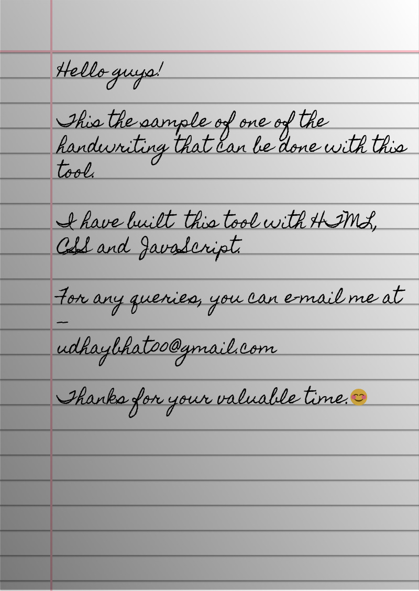

 
  <b><a href="https://saurabhdaware.github.io/text-to-handwriting/">https://saurabhdaware.github.io/text-to-handwriting/</a></b>  
 

 

 

 
  
  
  <a href="https://salesp07.github.io" target="_blank">
      <!-- sqlite, safari, google-chrome are other good icon options -->
  </a>
  

    <h3>Hate writing assignments ?</h3>
    
You can use my tool that can convert your provided text to a handwriiten image. 🫠

  

 

## 🌠 Output

## 📚 Libraries used

- [html2canvas](https://github.com/niklasvh/html2canvas) - Turns DOM into Canvas.
- [jsPDF](https://github.com/MrRio/jsPDF) - To generate PDF from images.
- [cypress](https://github.com/cypress-io/cypress) - Testing Library
- [serve](https://github.com/zeit/serve) - Start local server

<h2 align="center">🙋‍♂️ Support</h2>

<h3 align="center">💙 If you like this project, give it a ⭐ and share it with your friends!</h3>
 

    

<h3 align="center">
    
</h3>
 
